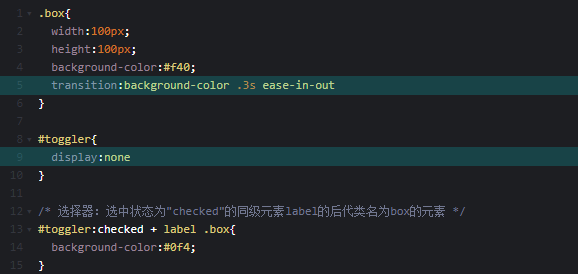

### 介紹如何使用 HTML+CSS 模仿 Apple.com 的 Hamburger Menu，以及展開與收起 Menu 時的動畫效果。


#### 基本

----

- 在不使用JS的情况下鼠标点击反馈效果 - checkbox

  - step1：定义一个input:checkbox

    ```html
    #HTML
    toggler<input type="checkbox" id="toggler">
    ```

    

    

  - step2：让该checkbox根据是否选中改变另一个元素的样式

    - 先测试一下：

      ```html
      <input type="checkbox" id="toggler">
      <label for="toggler">hello world</label>
      ```

      

      > 说明：这是我们对label和checkbox的常用组合方式，label即文字描述，我们此时我们可以不用点击checkbox的小方框只点击文字部分就能激活checkbox。所以接下来，我们往label里面添加一些元素，就能实现点击元素就能切换是否激活checkbox了。

    - 具体的：

      ```HTML
      <input type="checkbox" id="toggler">
      
      <label for="toggler">
        <div class="box"></div>
      </label>
      ```

      ```CSS
      .box{
        width:100px;
        height:100px;
        background-color:#f40;
      }
      /* 选择器：选中状态为"checked"的同级元素label的后代类名为box的元素 */
      #toggler:checked + label .box{
        background-color:#0f4;
      }
      ```

      

      - 添加一点动画过渡效果：

        

        

    

#### 具体

---


​    

​    

​    

​    

​    