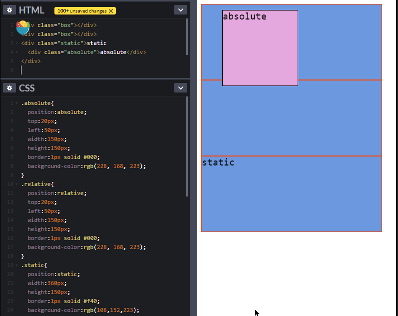

CSS position属性

`position`属性是HTML中非常重要的一个属性，它有五个属性值，分别是：`static`、`absolute`、`relative`、`fixed`、`sticky`。

## `static`

HTML里面所有元素的position默认值都是static 。
==top、 left、 right、 bottom 设定值不会对position为static的元素生效==

具有position为static属性值的元素，不会脱离文档流，

可见，position为static时，该元素不会脱离文档流（从上到下，从左到右），当其上面有内容增加，它会被挤下去。

## `absolute`

当position的属性值为absolute时， 即“绝对定位”，所谓绝对，就是==不受其他元素的影响。==使用absolute时，要用top、 left、 right、 bottom值对元素设定位置。例如：

==注意：==

- 1.当使用absolute的时候，如上图，如果有y向卷轴，拖动卷轴，元素是会随着移动的。
- 2.当使用absolute的时候，如果有嵌套元素，那么top、left、right、bottom位置的设定的==参考元素，是其父级元素==。例如：
  

## `relative`

relative元素有一点和static元素很相似，就是也会保持==在文档流内==，会受到其他元素的挤动。relative中文即“相对的”之意，所以在文档中，它是保持在文档流中的同时，还能通过top、left、right、bottom等位置属性，设定其相对其他元素的位置，而其在文档流中的位置，大小依然占位，所以会出现这种情况：

==relative的最关键的一个作用，我们常常把它和absolute结合使用==，当其子元素的position属性值为absolute时，该子元素，会相对其position属性值为relative的父元素定位。

这样，有==三点==好处：

- 可以保持在文档流中；（父元素为static的absolute子元素不行）

  

- 可以有top、left、right、bottom等位置属性的设定；(单独的static元素没有)

  

- 可以根据relative元素的位置，设定相对位置（position属性值为absolute的子元素的top、left、right、bottom位置控制属性，是相对其position属性值为relative的父级元素的。这样就能实现在任意位置设定需要的元素。

## `fixed`

fixed和absolute很相似，同的地方有两点：

- fixed会定位到屏幕中的固定位置，会根据body去定位。即便文档内容有卷动，其位置还是固定不改变。这不同于absolute，当文档内容可以卷动时，absolute元素会随着文档移动。
- 如果fixed元素有设定top、left、right、bottom的属性，即使放在position属性值为relative的元素里面，该fixed元素也会根据页面，即body去定位，而不是相对于其relative容器元素定位。

例如：

此时，黑色小方块没有设定相对位置，默认的它在relative元素里，此时，如果给黑色方块设定位置属性：

可以看到，它直接脱离了relative容器的束缚。

在使用relative和fixed的不同position属性嵌套元素时，注意一点：

##  `sticky`

sticky目前浏览器支持很少，属于实验阶段，也很有意思：

