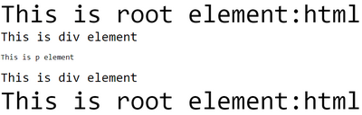

> 先言：本文基于大佬 Steven的视频教程的个人总结。[b站链接](https://www.bilibili.com/video/BV1d441167e9)。大佬有很多很棒的总结，真的少见。

CSS 中最常用到的五个尺寸单位：

- [px](#px)
- [em](#em)
- [rem](#rem)
- [vw&vh](#vwvh)
- [vmin&vmax](#vminvmax)
- [更多](#更多)

### px

px, 即pixels， 像素。 这是最为常用的一种css单位，不加赘述。

### em

相对单位，是基于当前元素的容器的字体大小来设定的。可以理解为倍数。例如

```html
<div>Hello<span>Hello This is Jayce</span>China</div>
```

```CSS
div {
  font-size: 30px;
}

span {
  font-size: 0.5em;
}
```

以上的显示结果就是，div元素内的字体大小为30px, span标签中的字体大小就是30 x 0.5 = 15px。


### rem

相对单位，和em很像，不过区别在于rem是相对根元素，而不是父级容器。简单的示例：

```html
<!DOCTYPE html>
<html>
<head>
<style>
html{
	font-size:60px
}

div {
  font-size: 30px;
}

p {
  font-size: 0.3rem;
}
</style>
</head>


<body>
This is root element:html
<div>
This is div element
<p>This is p element</p>
This is div element
</div>
This is root element:html
</body>
</html>

```

根元素html字体大小设定为60px, 其下级元素 div 的字体大小为 30 px， 其下下级元素 p 的大小是 0.3rem 。
此时，p 元素转换为 px ，就是60px x  0.3 = 18px 。



但是注意，如果这时候，你不单独指定 p 元素的大小，那么默认的，p 元素会继承其父元素的大小，即30px。


### vw&vh

vw 指的是 viewport width，即 可视区宽度，vh 指的是 viewport hight，即 可视区高度，。单位1 vw 即指的是1%的可视区宽度。20vh即20%的可是区域高度。

### vmin&vmax


vmin指的是设备最小的可视长度，vmax指的是设备最大的可视长度，1vmin 就是1%的设备最小可视长度。 以手机为例，最小的可视长度就是手机的宽度，最大可视长度就是手机的高度。

例如:

```HTML
<!DOCTYPE html>
<html>
<head>
    <style>
        
        *{
            overflow: hidden;
            margin: 0;
            padding: 0;
        }
        img{
            width: 100vmin;
        }
    </style>
</head>
<body>
    
</body>
</html>
```

你将看到如下效果：


我们设定了图片的宽度：`width:10vmin`,也就是说以手机最短的边（宽）的100%作为图片的高度，可见，这在手机横屏的时候比较容易理解，100vmin时，图片的宽度就是手机的宽度。

我们可以通过媒体查询，做一些改动。实现这样的效果：


```html
<!DOCTYPE html>
<html>

<head>
    <style>
        * {
            overflow: hidden;
            margin: 0;
            padding: 0;
        }
        
        @media screen and (orientation: portrait) {
            img {
                width: 100vmin;
            }
            /* 竖屏 */
        }
        
        @media screen and (orientation: landscape) {
            img {
                transform: translate(0, -28%);
                width: 100vmax;

            }
            /* 横屏 */
        }
    </style>
</head>

<body>
    
</body>

</html>
```


### 更多

[w3schools附表]():

| Unit | Description                                                  |      |
| :--- | :----------------------------------------------------------- | :--- |
| em   | Relative to the font-size of the element (2em means 2 times the size of the current font) |      |
| ex   | Relative to the x-height of the current font (rarely used)   |      |
| ch   | Relative to width of the "0" (zero)                          |      |
| rem  | Relative to font-size of the root element                    |      |
| vw   | Relative to 1% of the width of the viewport*                 |      |
| vh   | Relative to 1% of the height of the viewport*                |      |
| vmin | Relative to 1% of viewport's* smaller dimension              |      |
| vmax | Relative to 1% of viewport's* larger dimension               |      |
| %    | Relative to the parent element                               |      |