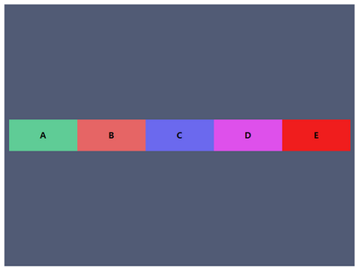

# #Flexbox 网页布局完全详解

## 前言

以前网页布局，有时候会使用表格，float等方式去处理网页的布局，但是，这些方式在被发明出来的时候，都不是用于网页排版用的，  而Flexbox就是第一套专注于网页布局的css方法。本文总结自[CodingStartUP-Steven](https://www.bilibili.com/video/BV1qJ411N7TA)，宝藏UP主。


### 准备

```html
<!DOCTYPE html>
<html>
<head>
    <link rel="stylesheet" href="style.css">
</head>
<body>
    <div class="A">A</div>
    <div class="B">B</div>
    <div class="C">C</div>
    <div class="D">D</div>
    <div class="E">E</div>
</body>
</html>
```

```css
div{
    line-height: 50px;
    text-align: center;
    font-weight: 600;
    color: #fff;
    width: 50px;
    height: 50px;
    border: 1px black solid;
    margin:5px;
}

.A{ background-color: rgb(219, 45, 45)}
.B{ background-color: rgb(103, 233, 86)}
.C{ background-color: rgb(240, 179, 88)}
.D{ background-color: rgb(127, 120, 226)}
.E{ background-color: rgb(50, 248, 182)}
```


### 开始

Flexbox的布局方式主要分为==两个角色==：

- Flex Container（Flex 容器）
- Flex Item（Flex 项目）


给所有元素套一个根容器：

```html
<body>
    <div class="flex-container">
        <div class="rectangle A">A</div>
        <div class="rectangle B">B</div>
        <div class="rectangle C">C</div>
        <div class="rectangle D">D</div>
        <div class="rectangle E">E</div>
    </div>
</body>
```

```css
.flex-container{
    display: flex;
}
```

此时，class为flex-container的div元素就变成了一个==Flex容器==，其中的ABCDE就是所谓的Flex Item，==Flex项目==。

​	 


# 下文目录

## [1.Flex Container](#1Flex-Container)

## [2.Flex Item](#2Flex-Item)

## [3.范例](#3范例)

## 1.Flex Container

----

- ### `flex-direction`:用于定义flex items的排序方向；

  - #### `flex-direction：row`：行向排序（默认的）；

  - #### `flex-direction：column`：列向排序；

    ```css
    .flex-container{
        background-color: #037F8C;
        display: flex;
        flex-direction: column;
    }
    ```

    

  - #### `flex-direction:row-reverse`：行向反转；

    ```css
    .flex-container{
        background-color: #037F8C;
        display: flex;
        flex-direction: row-reverse;
    }
    ```

    

    

  - #### `flex-direction:row-reverse`：列向反转；

    ```css
    .flex-container{
        background-color: #037F8C;
        display: flex;
        flex-direction: column-reverse;
    }
    ```

    

    


- ### 概念：主轴（main-axis）和交叉轴（cross-axis）

  ==主轴和交叉轴是不定的==，但是也是易于理解的。 取决于`flex-direction`的属性值的设定，

  - #### 当`flex-direction：row`的时候：

    main-axis（主轴）：row（行）

    cross-axis（交叉轴）：column（列）

  - #### 当`flex-direction：column`的时候：

    main-axis（主轴）：column（列）

    cross-axis（交叉轴）：row（行）

    > 即，设定flex-direction是行，主轴就是行，设定flex-direction是列，主轴就是列

- ### `justify-content`以及`align-items`

  - #### `justify-content`：

    ==`justify-content`==是设定==主轴==排序规则，常用的属性值有：

    - `justify-content:center`:主轴置中
    - `justify-content:flex-start`：主轴首部
    - `justify-content:flex-end`：主轴尾部

  - #### `align-items`：

    ==`align-items`==是设定==交叉轴==的排序规则;

    - `align-items:center`:交叉轴置中；
    - `align-items：flex-start`:交叉轴首部；
    - `align-items：flex-end`:交叉轴尾部

    ==当flex-direction:row时,主轴就是x轴，交叉轴就是y轴。当flex-direction:column时，主轴就是y轴，交叉轴就是x轴。==

    

  - #### ==注意：==当flex-direction属性值为row-reverse/column-reverse时，和row/column是有一些区别的，以当flex-direction:row和flex-direction:row-reverse时为例：

    


- ### `flex-wrap`

  flex-wrap是指会不会分行的意思，有两个通常我们会选择使用三个属性值，分别是：

  - nowrap：默认的，不分行，即在一行显示；

  - wrap：分行；

  - wrap-reverse：分行且反转。

    预备：

    ```html
        <body>
            <div class="flex-container">
                <div class="rectangle A">A</div>
                <div class="rectangle B">B</div>
                <div class="rectangle C">C</div>
                <div class="rectangle D">D</div>
                <div class="rectangle E">E</div>
            </div>
        </body>
    ```

    ```CSS
    .flex-container{
    background-color: rgb(81, 91, 117);
    height:500px;
    }
    .rectangle{
        width:60px;
        height:60px;
        line-height: 60px;
        text-align:center;
        font-size: 16px;
        font-weight:600;
        margin:5px;
    }
    .A{ background-color: rgb(95, 204, 150); }
    .B{ background-color: rgb(230, 101, 101); }
    .C{ background-color: rgb(107, 105, 238); }
    .D{ background-color: rgb(222, 80, 235); }
    .E{ background-color: rgb(240, 29, 29); }
    
    .flex-container{
        display: flex;
    }
    ```


- 

  - #### `flex-wrap:nowrap`

    我们复制成十个方块，并加大高度和宽度,并去掉margin值以更好的观察：

    

    我们可以看到，当加起来的width(90x10)超出了容器的width(没有设定，默认的就是视窗的100%)的时候，小方块会自动的响应缩减宽度。此时`flex-wrap`是默认值，即`nowrap`,所以，即便flex-items超出了容器宽度，也不会换行，而是会相应自适应的缩减宽度。

  

  - #### `flex-wrap:wrap`

    接下来，将flex-wrap的默认值改为wrap：

        .flex-container{
            flex-direction: row;
            display: flex;
            flex-wrap: wrap;
        }


​				可以看到，超出的内容被换行了。


- ### `flex-flow`(flex-direction + flex-wrap)

  flex-flow 只是flex-direction和flex-wrap组合起来的缩写，例如：

  ```css
  flex-row:column wrap
  ```

  就是等同于：

  ```css
  flex-direction:column;
  flex-wrap:wrap;
  ```


- ### `align-content`

  这个属性，是当flex-wrap：wrap的时候，只有当==多于一行flex items时才会生效==。它指的是==行与行之间的对齐方式==。通常我们会用到五个属性值，分别是：

  - #### center

  - #### flex-start

  - #### flex-end

  - #### space-around

  - #### space-between

  - #### stretch

  > flex-start：各行向弹性盒容器的起始位置堆叠。弹性盒容器中第一行的侧轴起始边界紧靠住该弹性盒容器的侧轴起始边界，之后的每一行都紧靠住前面一行。
  >
  > flex-end：各行向弹性盒容器的结束位置堆叠。弹性盒容器中最后一行的侧轴起结束界紧靠住该弹性盒容器的侧轴结束边界，之后的每一行都紧靠住前面一行。
  >
  > center：各行向弹性盒容器的中间位置堆叠。各行两两紧靠住同时在弹性盒容器中居中对齐，保持弹性盒容器的侧轴起始内容边界和第一行之间的距离与该容器的侧轴结束内容边界与第最后一行之间的距离相等。（如果剩下的空间是负数，则各行会向两个方向溢出的相等距离。）
  >
  > space-between：各行在弹性盒容器中平均分布。如果剩余的空间是负数或弹性盒容器中只有一行，该值等效于'flex-start'。在其它情况下，第一行的侧轴起始边界紧靠住弹性盒容器的侧轴起始内容边界，最后一行的侧轴结束边界紧靠住弹性盒容器的侧轴结束内容边界，剩余的行则按一定方式在弹性盒窗口中排列，以保持两两之间的空间相等。
  >
  > space-around：各行在弹性盒容器中平均分布，两端保留子元素与子元素之间间距大小的一半。如果剩余的空间是负数或弹性盒容器中只有一行，该值等效于'center'。在其它情况下，各行会按一定方式在弹性盒容器中排列，以保持两两之间的空间相等，同时第一行前面及最后一行后面的空间是其他空间的一半。
  >
  > stretch：各行将会伸展以占用剩余的空间。如果剩余的空间是负数，该值等效于'flex-start'。在其它情况下，剩余空间被所有行平分，以扩大它们的侧轴尺寸。
  >
  >
  > 来源：[前端开发博客](http://caibaojian.com/flexbox-guide.html)


- 例如：

  - #### `align-content: center;`

    ```css
    .flex-container{
        flex-direction: row;
        display: flex;
        flex-wrap: wrap;
        align-content: center;
    }
    ```


- - #### `align-content: flex-start;`

    ```css
    .flex-container{
        display: flex;
        flex-direction: row;
        flex-wrap: wrap;
        align-content: flex-start;
    }
    ```


  - 

    - #### `align-content: flex-end;`

      ```css
      .flex-container{
          display: flex;
          flex-direction: row;
          flex-wrap: wrap;
          align-content: flex-end;
      }
      ```


  - 

    - #### `align-content: space-around;`

      ```css
      .flex-container{
          display: flex;
          flex-direction: row;
          flex-wrap: wrap;
          align-content: space-around;
      }x
      ```


  - 

    - #### `align-content: space-between;`

      ```css
      .flex-container{
          display: flex;
          flex-direction: row;
          flex-wrap: wrap;
          align-content: space-between;
      }
      ```


  - 

    - #### `align-content: stretch;`

      ```css
      .flex-container{
          display: flex;
          flex-direction: row;
          flex-wrap: wrap;
          align-content: stretch;
      }
      ```


## 2.Flex Item

---

- ### `order`

  用于调整flex item 的排序位置

  ```css
  .A{ background-color: rgb(95, 204, 150); order:2}
  .B{ background-color: rgb(230, 101, 101); order:5}
  .C{ background-color: rgb(107, 105, 238); order:3}
  .D{ background-color: rgb(222, 80, 235); order:1}
  .E{ background-color: rgb(240, 29, 29); order:4}  
  ```

  原来的：


​		变成了：


​		order值越小排在越前，可以为负数。


- ### `align-self`

  用于覆写flex container的align-items设定。用于单独的置顶某个元素的交叉轴的对称规则,例如：

    ```css
  .flex-container{
      display: flex;
      flex-direction: row;
      align-items: center;
      justify-content: center;
  }
    ```


```css
.A{ background-color: rgb(95, 204, 150); align-self: flex-start;}
.B{ background-color: rgb(230, 101, 101); }
.C{ background-color: rgb(107, 105, 238); }
.D{ background-color: rgb(222, 80, 235); align-self: flex-end;}
.E{ background-color: rgb(240, 29, 29); }
```


- ### `flex-basis`

  flex-basis是用于设定flex-item的主轴方向的大小的，也就是主轴方向元素的大小，原来指定的高度宽度，就会失效，被重新覆写。

    ```css
  .flex-container{
      display: flex;
      flex-direction: row;
      flex-wrap: wrap;
      align-items: center;
      justify-content: center;
  }
    ```

    ```css
  .rectangle{
      width: 60px;
      height: 60px;
      margin: 0;
      flex-basis: 130px;
  }
    ```

  由于，方块的父级容器指定了flex-direction:row,所以主轴就是行。 因此flex-basis的值等于设定==flex-item==的宽度。也就是==方块的width属性被覆写了==。



​		此时，如果把主轴改变为列，即把flex-direction的属性住修改为column。

```css
.flex-container{
    display: flex;
    flex-direction: column;
    flex-wrap: wrap;
    align-items: center;
    justify-content: center;
}
```


​		如果flex-basis的值设定为0，那么就等同于把元素的width设定为0。只要容器本身没有overflow：hidden的设定，它的大小就取决于内容的大小。如果设定为auto则代表按照元素本身的大小去计算。即如果小方块的原来的width值为60px，此时如果flex-basis值为auto，则小方块的大小就是60px宽。

```css
.rectangle{
    width: 60px;
    height: 60px;
    margin: 0;
    flex-basis: 0;
}

.flex-container{
    display: flex;
    flex-direction: row;
    flex-wrap: wrap;
    align-items: center;
    justify-content: center;
}
```


- ### `flex-grow`

flex-grow是指当flex container主轴方向==有剩余空间的时候==，flex item沿着主轴方向扩大的设定。

预备：

```css
.flex-container{
    display: flex;
    flex-direction: row;
    flex-wrap: wrap;
    align-items: center;
    justify-content: center;
    width: 300px;
    height:300px;
}
```


此时，容器的宽度是300px，方块的总宽度是3x60 = 180px。多出120px。

给小方块加上下面样式：

```css
.rectangle{
    flex-grow:1;
}
```


flex-grow:1中的1就是占一份的意思，==即是三个小方块去平分剩余的120px空间。==此时每个方块的宽度就是：60px  + 120px/3 = 100px。

将中间的方块flex-grow值改大点：

```css
.rectangle{
    flex-grow:1;
}
.B{
    flex-grow:5;
}
```


此时，A、C的width为：120px/7 x 1。B的width则是120px/7 x 5。


- ### `flex-shrink`

flex-shrink则与flex-grow是相反的。 是指==当flex items d的大小总和超出了flex container的时候，flex item沿着主轴方向的收缩规则。==。即，当元素的大小总和超出了容器的时候，要想所有元素任然在容器内，就需要让元素收缩，这个是时候，flex-shrink就是用来定义这种收缩规则的。


flex-grow和flex-shrink，一个是在元素够装，容器有空余空间的时候指定分配规则。一个是当在元素超出了容器，容器不够装时，指定元素的收缩规则。

```html
.rectangle{
    width: 150px;
    height: 120px;    
}
.flex-container{
    flex-wrap: nowrap;
    width: 300px;
    height: 300px;
}
```

此时容器大小300px宽，元素总宽450px，超出150px。


可以看到，虽然，元素在一行中放下了，但是元素都收缩了。 这是由于flex-shrink的默认值是1。 如果我们把flex-shrink改为0：

```css
.rectangle{
    flex-shrink: 0;
}
```


可以看到，flex-items直接超出了flex-container（元素超出了容器。）。

此时，我们做以下修改：

```css
.A{ flex-shrink: 1; }
.B{ flex-shrink: 2; }
.C{ flex-shrink: 3; }
```


容器缺少宽度：300px - 150px x 3 = -150px

此时各个方块的需要收缩的宽度是： 

widthA收缩 = -150px / (1+2+3) * 1 

WidthB收缩 = -150px/（1+2+3）*2

WidthC收缩 = -150px/（1+2+3）*3


- ### `最后 flex`

flex是flex-grow、flex-shrink、flex-basis组合起来的缩写。

例如：

```css
flex:1 1 auto;
```

元素将在有剩余空间时同步方法，在没有剩余空间时同步缩小。

```css
flex:0 1 150px
```

即每一个flex item的宽度最多是150px，且只会因为flex container空间不足时缩小。而不会因为flex container空间剩余而填充扩大。

```css
flex:0 0 200px;
```

指定每个元素的大小是200px，不会因容器的不足或者剩余而适应变化。

#### 3.范例


html

```html
<!DOCTYPE html>
<html lang="en">
<head>
    <meta charset="UTF-8">
    <meta name="viewport" content="width=device-width, initial-scale=1.0">
    <link rel="stylesheet" href="style.css">
    <script src="https://kit.fontawesome.com/8dbe2debea.js" crossorigin="anonymous"></script>
</head>
<body>
    <div class="nav-bar">
        <li class="menu">
            <i class="fa fa-bars" aria-hidden="true"></i>
        </li>
        <li class="icon">
            <i class="fa fa-apple" aria-hidden="true"></i> 
        </li>
        <li class="cart">
            <i class="fa fa-shopping-cart" aria-hidden="true"></i>
        </li>
    </div>
</body>
</html>
```

css

```css
*{
    margin: 0;
    padding: 0;
}
li{
    list-style:none;
    line-height: 30px;
    font-size: 20px;
    color:#fff;
}
i{
    padding: 5px;
}
.nav-bar{
    min-width: 414px;
    height: 30px;
    background-color:#000;
    display: flex;
    justify-content: space-between;
}
```

